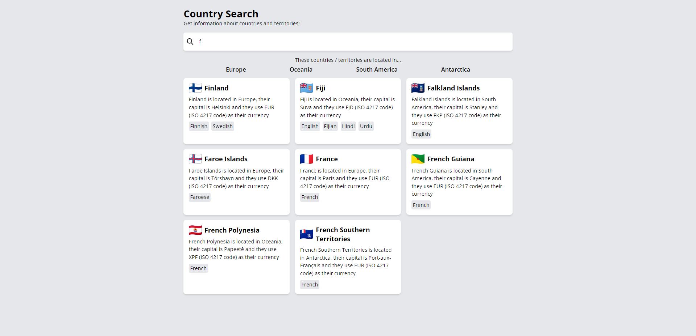
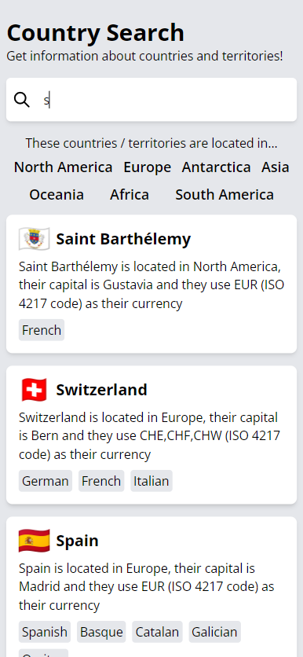

# Desafío para Software Engineers

Nombre postulante: René Emanuel Cáceres Abarzua

Link a la app en producción: [Website](https://countrysearch1.netlify.app/)

|            Desktop            |            Mobile            |
| :---------------------------: | :--------------------------: |
|  |  |

## Consideraciones que se tomaron

- Si bien el grafo venía con un emoji para la bandera, [esta no era visible en Windows](https://www.emojiall.com/en/blog/321) por lo que decidi usar [Flagpedia waving flag](https://flagpedia.net/download/icons) a través de los códigos de país que daba el grafo.
