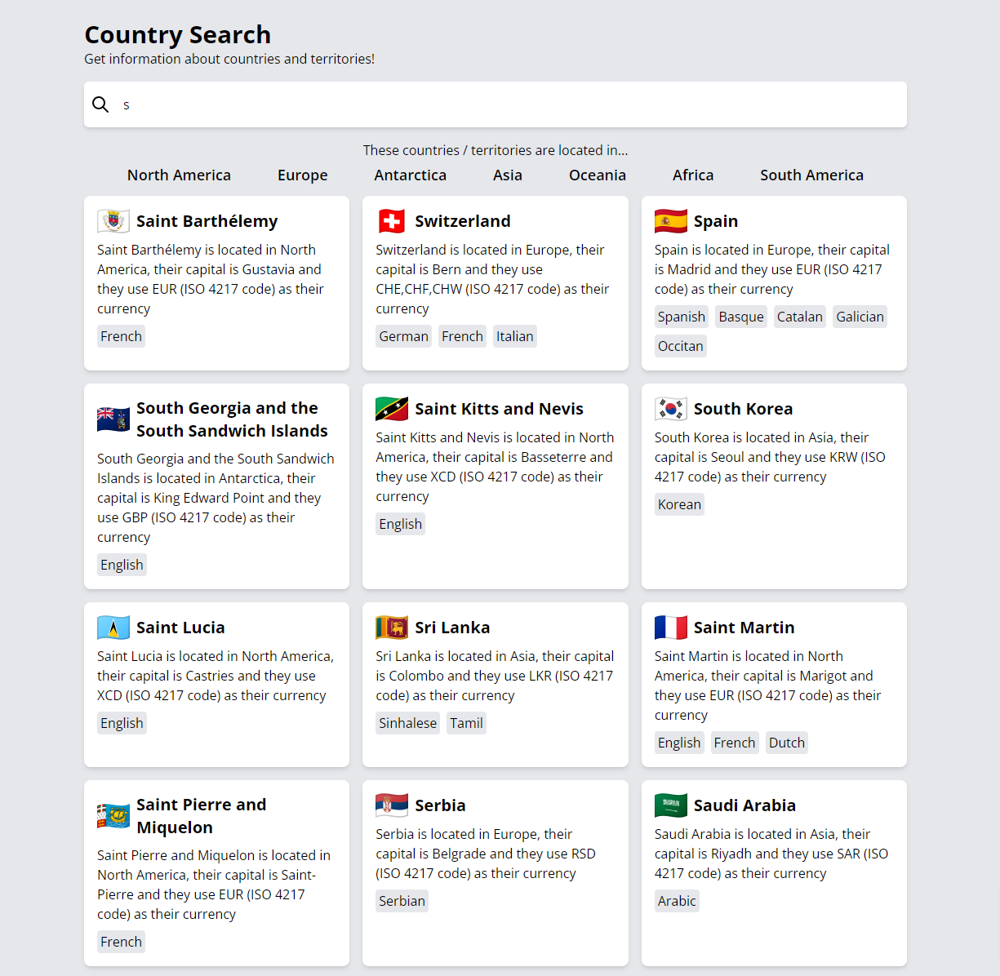

# Desafío para Software Engineers

Nombre postulante: René Emanuel Cáceres Abarzua

Link a la app en producción: [Website](https://countrysearch1.netlify.app/)

|            Desktop            |            Mobile            |
| :---------------------------: | :--------------------------: |
|  |  |

## Tech Stack
- React, ApolloClient
- Vite (instead of Create React App)
- Tailwind CSS for beautiful styling

## Consideraciones que se tomaron

- Si bien el grafo venía con un emoji para la bandera, [esta no era visible en Windows](https://www.emojiall.com/en/blog/321) por lo que decidi usar [Flagpedia waving flag](https://flagpedia.net/download/icons) a través de los códigos de país que daba el grafo.

## Respuesta a pregunta sobre bajar el tiempo de respuesta en MySQL
No estoy muy familiarizado con como optimizar el rendimiento de bases de datos SQL, pero he escuchado que son "verticales", que al aumentar la potencia de las máquinas donde corren es posible tener más consultas, a diferencia de las nosql que son "horizontales" que escalan mejor con más máquinas
